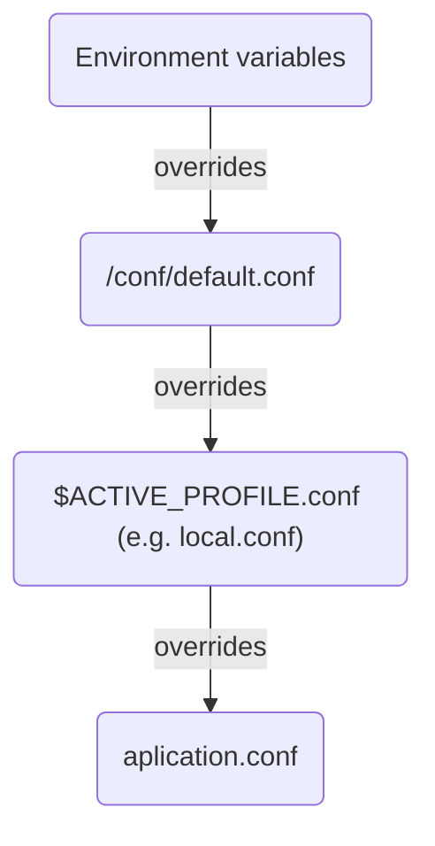

# Environment Specific Configuration
This library wraps Typesafe's config library and adds environment specific features to it.
The problem was that we needed to set different config files for each environment.
That's why I developed this tool.

It works by reading an environment variable named `ACTIVE_PROFILE` and looking for a
file named `$ACTIVE_PROFILE.conf`. If no `ACTIVE_PROFILE` env is set, it will be set to
`local` by default. Also, the fallback file is `application.conf`; so if no other config
files exist (like `local.conf`), the configs in `application.conf` will be used.

There is also another file named `default.conf` that overrides all other files if
it exists. The `EnvironmentSpecificConfig` will check `/conf` directory for a file
named `default.conf`. It is totally optional - we prefer this method for production.

This is how configs are overrided:


### How to use
After creating config files, you can create an instance of the `EnvironmentSpecificConfig`
and can methods on it to access configs.

```
val config = new EnvironmentSpecificConfig

val version = config("version")
val amount = config.getInt("amount")
val multipleConfigs = config.getInt("multiple-configs")
```

If you want to check the `ACTIVE_PROFILE` that's in use:
``` 
println(config.selectedProfile) 
```

You can use these methods as `getOrElse`:
```
config.confOrElse("non-existent-string", "anotherString")
config.confOrElse("non-existent-int", 6841)
```

You can also refer to tests to see how to use the library.